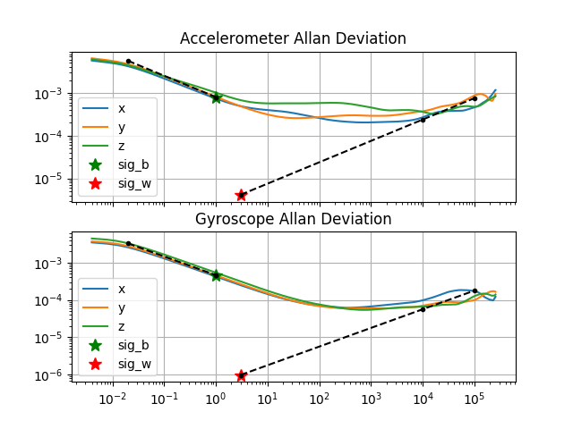

# IMU Still Calibration

Inertial measurements can be used for a various applications, as pure inertial odometry or Visual-Inertial SLAM methods. As cameras, Inertial Measurement Units must be well calibrated to correctly estimate the movements of a the sensor.

This repository contains a calibration tool based on **Python** for IMUs, following the model presented in [The TUM VI Benchmark for Evaluating Visual-Inertial Odometry](https://arxiv.org/pdf/1804.06120.pdf). The tool models the bias and random walk parameters of a still IMU through Allan Variances, and then estimates them. For a sufficient calibration, it is recommended to store measures during large periods of time (> 80 h).

If you use this code in your research, we would appreciate if you cite the respective publication.

**A Dataset for Visual Inertial Odometry in Challenging Environments with Low-texture and HDR Illuminations**
(D. Zuñiga-Noël, A. Jaenal, R. Gomez-Ojeda, J Gonzalez-Jimenez),
*In *, .
[[pdf]()]

# Usage

The code is based on Python 3, using default libraries as *numpy* and *matplotlib*.

```
Example:
python calibrate_imu.py /mnt/data/UMAVI/measures.npy -f=250
```

```
usage: calibrate_imu.py [-h] [-f FREQUENCY] [-w WINDOWS] [-n NUM_SAMPLES]
                        [-o DEVORDER] [-a ACCVARS] [-g GYROVARS] [-v]
                        [--limWlow LIMWLOW] [--limWupp LIMWUPP]
                        [--limBlow LIMBLOW] [--limBupp LIMBUPP]
                        numpy_path

positional arguments:
  numpy_path            Path to a .npy file for the dataset

optional arguments:
  -h, --help                                        show this help message and exit
  -v, --verbose
  -f FREQUENCY, --frequency FREQUENCY               Sampling frequency (default: 200.0 Hz)
  -w WINDOWS, --windows WINDOWS                     Minimum windows for the Tau loop (default: 30)
  -n NUM_SAMPLES, --num_samples NUM_SAMPLES         Number of samples for the Allan Computation(default: 2200)
  -o DEVORDER, --devOrder DEVORDER                  Device saving order: 0 - Gyro/Acc (default), 1 - Acc/Gyro
  -a ACCVARS, --accVars ACCVARS                     Accelerometer variables used for the printing. Ex: xyz, xz
  -g GYROVARS, --gyroVars GYROVARS                  Gyroscope variables used for the printing. Ex: xyz, xz
  --limWlow LIMWLOW     Minimum integration time for the bias_w (default: 0.02 s)
  --limWupp LIMWUPP     Maximum integration time for the bias_w (default: 1 s)
  --limBlow LIMBLOW     Minimum integration time for the bias_b (default: 1000 s)
  --limBupp LIMBUPP     Maximum integration time for the bias_b (default: 6000 s)

```

## Input

The input file should be a .npy file with the next size and format:
```
Size: 
[num_samples x 7 (8)] 

Format: 
# Example: timestamp, gyro_x, gyro_y, gyro_z, accel_x, accel_y, accel_z, (temperature)   -->   --devOrder=0
OR
# Example: timestamp, accel_x, accel_y, accel_z, gyro_x, gyro_y, gyro_z, (temperature)   -->   --devOrder=1
```

The order of the sensor measurements is indicated by the flag *devOrder*. The temperature is not taken care of yet, so it is between brackets and it is not necessary to include it into the .npy file.

## Output

The script outputs an image with the graphic (as the shown) and a .yaml file with the Noise density and Biases for each device.
As an intermediate step, the script outputs a file (.../npypath_AllanVar.npy) which contains all the integrated measures for a fixed frequency to avoid waiting large periods of time if we want to change the display parameters (integration time limits, printing variables).

### UMA Visual Inertial Dataset Calibration

The IMU still calibration (Xsens MTi-28A53G35) from the [UMA VI dataset](http://mapir.isa.uma.es/mapirwebsite) has the next input:

As remarkable parameters, in the UMA VI dataset the frequency is 250 Hz and the integration time limits are changed to fit with the more "linear" part (0.02-1 s, 10000-10000 s).

```
python3 calibrate_imu.py ./results/UMAvi_imu_still_2019-02-15-16-49-53.npy -f=250 -w=30 -n=2200 --limBlow=10000 --limBupp=100000
```



```
#Accelerometers
accelerometer_noise_density: 0.0007970737515806496 #Noise density (continuous-time)
accelerometer_random_walk: 4.134509826460877e-06 #Bias random walk

#Gyroscopes
gyroscope_noise_density: 0.00046306229509090514 #Noise density (continuous-time)
gyroscope_random_walk: 9.798339194666108e-07 #Bias random walk

rostopic: /imu0/data #the IMU ROS topic
update_rate: 250.0 #Hz (for discretization of the values above)
```

### TUM Visual Inertial Dataset IMU Calibration

The IMU still calibration (BMI160) from the [TUM VI dataset (calib-imu-static2)](https://vision.in.tum.de/data/datasets/visual-inertial-dataset) has the next input:

As remarkable parameters, in the TUM VI dataset paper is shown that for the gyroscope they only evaluate the measures for the axes y and z (-g=yz) and the integration time limits are the defaults (0.02-1 s, 1000-6000 s).

```
python3 calibrate_imu.py ./results/TUMvi_still_imu.npy -f=200 -w=30 -n=2200 -g=yz
```

The script output is the next (the results of TUM can be visualized on their page, being quite similar):


```
#Accelerometers
accelerometer_noise_density: 0.0013588692876997399 #Noise density (continuous-time)
accelerometer_random_walk: 8.157817021466894e-05 #Bias random walk

#Gyroscopes
gyroscope_noise_density: 8.078661856971916e-05 #Noise density (continuous-time)
gyroscope_random_walk: 2.1948834995716578e-06 #Bias random walk

rostopic: /imu0/data #the IMU ROS topic
update_rate: 200.0 #Hz (for discretization of the values above)
```


## Memory comsumption
**WARNING:** the script is executed on RAM and can saturate it. The --num_samples flag purpose is to decrease the interpolation points of the IMU integrated response curve, which will free the RAM obtaining a lower precision.

# License

This project has been developed by Alberto Jaenal at the [MAPIR group](http://mapir.uma.es/mapirwebsite/) in 2019, being currently maintained by its author.

This project is available under a BSD 3-Clause license. See [LICENSE.txt](LICENSE.txt)